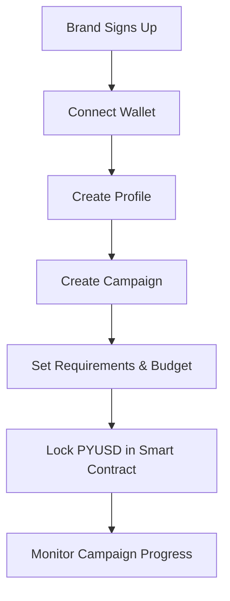
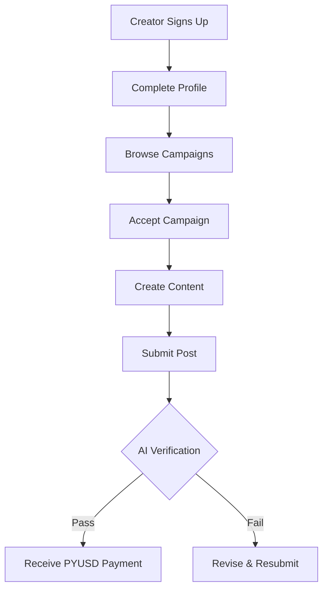
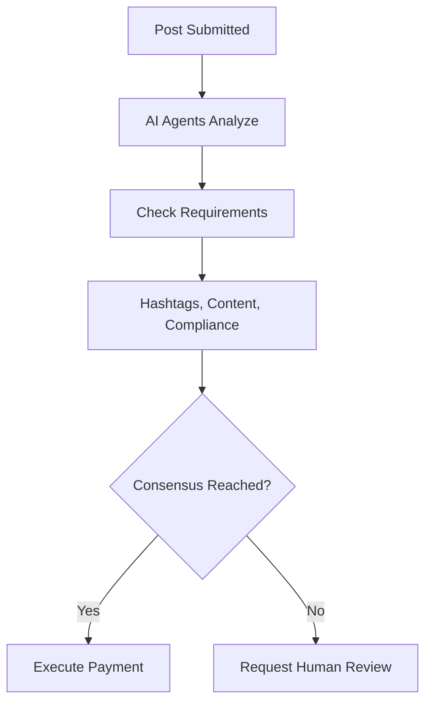

# 🚀 Decentralized Influencer Platform

A trustless, on-chain platform that connects brands with creators using AI-powered verification and PYUSD payments. Built for ETHDelhi Hackathon with integrations for **ASI Alliance** (AI verification) and **PayPal PYUSD** (stable payments).

## 🎯 Problem & Solution

**Problem**: Brands struggle to find trustworthy creators, and creators face payment delays and unfair compensation.

**Solution**: A decentralized platform where:

- ✅ Smart contracts guarantee payments upon AI-verified completion
- ✅ ASI Alliance AI agents automatically verify campaign requirements
- ✅ PYUSD enables stable, predictable payments
- ✅ On-chain reputation system builds trust
- ✅ 72-hour guaranteed payment window

## 🏗️ Architecture

```
┌─────────────────┐    ┌─────────────────┐    ┌─────────────────┐
│   PlatformCore  │────│ CampaignManager │────│  PaymentEscrow  │
│  (Orchestrator) │    │   (Lifecycle)   │    │ (PYUSD Escrow)  │
└─────────────────┘    └─────────────────┘    └─────────────────┘
         │                       │                       │
         └───────────────────────┼───────────────────────┘
                                 │
         ┌─────────────────┐    ┌─────────────────┐
         │  UserRegistry   │────│ AIVerification  │────┐
         │ (Profiles/Rep)  │    │ (ASI Alliance)  │    │
         └─────────────────┘    └─────────────────┘    │
                                         │             │
                                    ┌─────────────────────────┐
                                    │     ASI Alliance        │
                                    │   (AI Verification)     │
                                    │  - uAgents Framework   │
                                    │  - Agentverse Deploy   │
                                    │  - Multi-Agent Consensus│
                                    └─────────────────────────┘
```

## 🛠️ Technical Stack

- **Smart Contracts**: Solidity 0.8.19, OpenZeppelin Upgradeable
- **Payments**: PayPal USD (PYUSD) ERC-20 token
- **AI Verification**: ASI Alliance (Fetch.ai uAgents)
- **Development**: Foundry, Ethers.js, TypeScript

## 🚀 Quick Start

### Prerequisites

```bash
# Node.js 16+ and npm
node --version  # Should be 16+
npm --version

# Git
git --version
```

### Installation

```bash
# Clone repository
git clone https://github.com/your-username/decentralized-influencer-platform.git
cd decentralized-influencer-platform

# Install dependencies
npm install

# Copy environment variables
cp .env.example .env
# Edit .env with your configuration
```

### Environment Setup

```bash
# .env file - Update these values
PRIVATE_KEY=your_private_key_here
INFURA_API_KEY=your_infura_key
ETHERSCAN_API_KEY=your_etherscan_key
ASI_API_KEY=your_asi_alliance_key  # For AI verification
```

### Deployment

```bash
# Compile contracts
npm run compile

# Run tests
npm test

# Deploy to local network
npm run node  # In one terminal
npm run deploy:local  # In another terminal

# Deploy to testnet
npm run deploy:sepolia

# Verify contracts (after deployment)
npm run verify:sepolia
```

## 📋 Contract Details

### Core Contracts

| Contract            | Purpose                 | Key Features                                        |
| ------------------- | ----------------------- | --------------------------------------------------- |
| **PlatformCore**    | Main orchestrator       | Campaign creation, post submission, role management |
| **CampaignManager** | Campaign lifecycle      | Campaign CRUD, creator acceptance, post tracking    |
| **PaymentEscrow**   | PYUSD payments          | Secure escrow, automatic payouts, fee management    |
| **AIVerification**  | AI-powered verification | ASI Alliance integration, multi-agent consensus     |
| **UserRegistry**    | User management         | Brand/creator profiles, reputation, verification    |

### Integration Contracts

| Integration      | Contract           | Purpose                                     |
| ---------------- | ------------------ | ------------------------------------------- |
| **ASI Alliance** | AIVerification.sol | Automated post verification using AI agents |
| **PayPal PYUSD** | PaymentEscrow.sol  | Stable USD payments with low fees           |

## 🔄 Platform Flow

### Brand Journey



### Creator Journey



### AI Verification Process



## 🧪 Testing

### Run Test Suite

```bash
# Run all tests
npm test

# Run with gas reporting
npm run test:gas

# Run coverage report
npm run coverage

# Run specific test file
npx hardhat test test/Platform.test.js
```

### Test Scenarios

- ✅ User registration (brands & creators)
- ✅ Campaign creation and management
- ✅ AI verification workflow
- ✅ PYUSD payments and escrow
- ✅ Reputation system
- ✅ Error handling and security
- ✅ Platform economics and fees

## 🌐 Deployment Addresses

### Testnet Deployments

#### Sepolia Testnet

```
PlatformCore:     0x...
CampaignManager:  0x...
PaymentEscrow:    0x...
UserRegistry:     0x...
AIVerification:   0x...
Mock PYUSD:       0x...
```

#### Mumbai Testnet

```
PlatformCore:     0x...
CampaignManager:  0x...
PaymentEscrow:    0x...
UserRegistry:     0x...
AIVerification:   0x...
Mock PYUSD:       0x...
```

### Mainnet (Production Ready)

_Deployment addresses will be updated after mainnet deployment_

## 🤖 ASI Alliance Integration

### AI Agent Setup

The platform integrates with ASI Alliance's uAgents framework for decentralized AI verification:

```javascript
// Register AI agents
await aiVerification.registerAIAgent(
  agentAddress,
  "https://agentverse.ai/agents/content-verifier",
  "Content verification, hashtag analysis, compliance checking"
);
```

### Verification Process

1. **Multi-Agent Analysis**: Multiple AI agents verify each post
2. **Consensus Mechanism**: Majority agreement required for approval
3. **Confidence Scoring**: Each agent provides confidence level (0-100%)
4. **Automated Execution**: Smart contract automatically releases payment

### Agent Reputation System

- Agents earn reputation based on verification accuracy
- Higher reputation agents get more verification requests
- Poor-performing agents are automatically demoted

## 💰 PYUSD Integration

### Payment Flow

```solidity
// 1. Brand deposits PYUSD to escrow
function depositCampaignBudget(uint256 campaignId, uint256 amount) external;

// 2. Creator submits post, payment is reserved
function reservePayment(uint256 campaignId, uint256 submissionId, uint256 amount) external;

// 3. AI verification passes, payment is released
function executePayment(address creator, uint256 amount, uint256 campaignId) external;
```

### Fee Structure

- **Platform Fee**: 2.5% (configurable)
- **Creator Payment**: 97.5% of campaign budget
- **Gas Optimization**: Batched operations to minimize transaction costs

### Cross-Chain Support

The platform is designed to work across multiple networks where PYUSD is available:

- Ethereum Mainnet
- Polygon
- Base (upcoming)

## 🔐 Security Features

### Smart Contract Security

- **Upgradeable Contracts**: UUPS proxy pattern for bug fixes
- **Role-Based Access**: Granular permissions using OpenZeppelin AccessControl
- **Reentrancy Protection**: All external calls protected
- **Time Locks**: 24-hour delay for critical operations
- **Circuit Breakers**: Emergency pause functionality

### Economic Security

- **Escrow Protection**: Payments locked in smart contracts
- **Multi-Signature**: Admin operations require multiple signatures
- **Rate Limiting**: Prevention of spam campaigns
- **Dispute Resolution**: On-chain dispute handling mechanism

## 📊 Platform Analytics

### Key Metrics Tracked

- Total campaigns created
- Total PYUSD volume processed
- Creator success rates
- AI verification accuracy
- Platform fee collection
- User reputation scores

### Monitoring Dashboard

```bash
# Get platform statistics
const stats = await paymentEscrow.getPlatformStats();
console.log("Total Volume:", ethers.utils.formatUnits(stats.totalVolume, 6));
console.log("Active Campaigns:", stats.activeCampaigns.toString());
```

## 🎯 Hackathon Integration

### ASI Alliance ($10,000 Prize)

**Integration Points**:

- ✅ uAgents framework for AI verification
- ✅ Multi-agent consensus mechanism
- ✅ Agentverse deployment for agent orchestration
- ✅ Real-time verification with < 1 minute response time

**Demo Features**:

- AI agents automatically verify:
  - Required hashtags present
  - Brand mentions included
  - Content quality assessment
  - Compliance with campaign guidelines

### PayPal PYUSD ($10,000 Prize)

**Integration Points**:

- ✅ PYUSD as native payment currency
- ✅ Automatic escrow and release mechanism
- ✅ Cross-border payments with stable value
- ✅ Low-fee transactions optimized for creator payments

**Demo Features**:

- Brands deposit campaign budgets in PYUSD
- Automatic payment release upon verification
- Real-time balance tracking and fee calculation
- Easy fiat on/off ramp integration ready

## 🚀 Future Roadmap

### Phase 1: Core Platform (Hackathon)

- ✅ Smart contract deployment
- ✅ AI verification integration
- ✅ PYUSD payment system
- ✅ Basic user profiles

### Phase 2: Enhanced Features

- 🔄 Advanced reputation algorithms
- 🔄 Dispute resolution system
- 🔄 Multi-platform content support (Instagram, TikTok)
- 🔄 Campaign analytics dashboard

### Phase 3: Ecosystem Growth

- 🔄 Creator marketplace
- 🔄 Brand relationship management
- 🔄 Advanced AI verification (video, image analysis)
- 🔄 Cross-chain deployment

### Phase 4: Enterprise Features

- 🔄 White-label solutions
- 🔄 Enterprise APIs
- 🔄 Advanced analytics and reporting
- 🔄 Compliance tools for different markets

## 🤝 Contributing

We welcome contributions! Please see our [Contributing Guide](CONTRIBUTING.md) for details.

### Development Setup

```bash
# Fork the repository
git fork https://github.com/original-repo/decentralized-influencer-platform.git

# Create feature branch
git checkout -b feature/your-feature-name

# Make changes and test
npm test

# Submit pull request
```

### Code Style

- Follow Solidity style guide
- Use Prettier for formatting
- Include comprehensive tests
- Document all public functions

## 📞 Support & Community

- **Discord**: [Join our community](https://discord.gg/your-invite)
- **Telegram**: [Development updates](https://t.me/your-channel)
- **Twitter**: [@YourPlatform](https://twitter.com/your-handle)
- **Email**: support@your-platform.com

## 📜 License

This project is licensed under the MIT License - see the [LICENSE](LICENSE) file for details.

## 👨‍💻 Author

**This project is made by Yash Jain**

Connect with me:

- GitHub: [@yashjain-eth](https://github.com/yashjain-eth)
- Twitter: [@yash_web3](https://twitter.com/yash_web3)
- LinkedIn: [Yash Jain](https://linkedin.com/in/yash-jain-blockchain)

## 🙏 Acknowledgments

- **ASI Alliance** for providing AI verification infrastructure
- **PayPal** for PYUSD integration and stable payments
- **ETHDelhi** for hosting this incredible hackathon
- **OpenZeppelin** for secure smart contract libraries
- **Hardhat** for development framework

---

**Built with ❤️ for ETHDelhi 2025 by Yash Jain**

_Creating the future of creator economy, one verified post at a time._

forge script script/Deploy.s.sol:DeployScript --rpc-url sepolia_testnet --private-key $PRIVATE_KEY --broadcast --verify -vvvv

= DEPLOYED CONTRACTS ===
PlatformCore: 0x88be409BaD965786B38CDe89587A750338800FD3
CampaignManager: 0x72dE7047B87EC45cC1e3871E39467bC1AF69D65d
PaymentEscrow: 0xC01aEC49bA01EDD3d65BB7B12df2176F1D098819
UserRegistry: 0xA3406227A5523e79f3956a025CEb8a7c280d647e
AIVerification: 0xFDDa2A840CAe089f046B94E9E6A7A4299B3b9260
